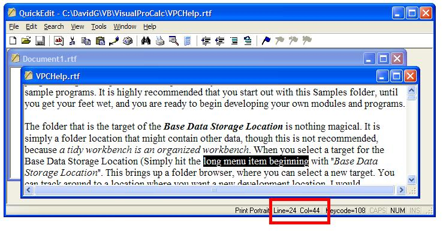



## Get Row and Column positions Fast in a Textbox or Rich Textbox \(clean\-up\)

### Description

This short article will show you how you can EASILY obtain an accurate logical text row count, plus the logical row and column number the cursor is located at in a Textbox or Rich Textbox. Line wraps that will force several additional displayed lines are no problem at all, and the returned indexes will account for them. Plus, afterward, I will show you how you can quickly dress up a selection in a textbox so that it is not always at the bottom of the textbox. Because these textbox controls have to manage these row and column counts and indexes anyway, why not let THEM do ALL the work for you.
 
### More Info
 

             |
---                |---
**Submitted On**   |
**By**             |[David Ross Goben](https://github.com/Planet-Source-Code/PSCIndex/blob/master/ByAuthor/david-ross-goben.md)
**Level**          |Intermediate
**User Rating**    |4.9 (49 globes from 10 users)
**Compatibility**  |VB 6\.0
**Category**       |[Windows API Call/ Explanation](https://github.com/Planet-Source-Code/PSCIndex/blob/master/ByCategory/windows-api-call-explanation__1-39.md)
**World**          |[Visual Basic](https://github.com/Planet-Source-Code/PSCIndex/blob/master/ByWorld/visual-basic.md)
**Archive File**   |

### Source Code

<b>
 
 Get Row and Column Positions Fast in a Textbox or Rich Textbox 
 </b>
By David Ross Goben 
  
 <i>You are free to use this information, plus the included snippets in your own
 code without even acknowledging my work or me.</i> 
 A number of people have asked me over the years how to grab the line count,
 line number, and column position the cursor is located at in a Textbox or Rich
 Textbox. Other queries regarded positioning the cursor for display. 
  
 I have seen a number of samples published here, but they involved VB-only solutions,
 usually using the <i>Split()</i> function. This is fine for short lines,
 but if you are writing a text editor (every programmer should write at least
 one text editor during their career - I have written 8 descent ones, 2 multi-document
 editors, and VERY profitable professional word-processing and spell-checker packages that used
 to sell for the Tandy Model I/III/4 TRS-80s). 
  
 Most examples for obtaining the row count, row number, and column usually employ
 a lot of math, because it is a rather complex thing to do. This is due to the reason
 that multi-line text boxes more often than not have lots of line wraps and such,
 which forces most VB-only methods to fail miserably. 
  
 However, by utilizing just a single API function and 4 constants, we can obtain
 everything we need in just a very few lines of code by letting the Textbox or
Rich Textbox do all the work for us. 
  
 We will require the <b>SendMessage()</b> API, but we want to use it without
the <b><i>As Any</i></b> frivolity that the VB6 API Viewer provides (the API
Viewer is activated under the <b><i>Add-Ins</i></b> menu via the <b><i>Add-In Manager</i></b>;
select the <b><i>VB 6 API Viewer</i></b> and ensure that the <b><i>Loaded/Unloaded</i></b>
and <b><i>Load on Startup</i></b> options are checked). As such, we will rename it
<b>SendMessageByNum()</b>, and change its <i>lParam</i> from <b><i>As Any</i></b>
to <b><i>As Long</i></b>. We will also grab 4 constants from the API Viewer: <i>EM_LINEFROMCHAR, EM_LINEINDEX, EM_GETLINECOUNT,
</i>and<i> EM_LINESCROLL</i>. 
  
 So far, we have the following code in our module or form or class (or wherever
 you need to use these things in): 
  
 
<b>
 Private Declare Function SendMessageByNum
 Lib &quot;user32&quot;
 Alias &quot;SendMessageA&quot;
 _ 
 &nbsp;&nbsp;&nbsp;&nbsp;&nbsp;&nbsp; (ByVal  hwnd
 As Long,
 _ 
 &nbsp;&nbsp;&nbsp;&nbsp;&nbsp;&nbsp;&nbsp; ByVal  wMsg
 As Long,
 _ 
 &nbsp;&nbsp;&nbsp;&nbsp;&nbsp;&nbsp;&nbsp; ByVal  wParam
 As Long,
 _ 
 &nbsp;&nbsp;&nbsp;&nbsp;&nbsp;&nbsp;&nbsp; ByVal  lParam
 As Long)
 As Long 
  
 Private Const EM_LINEFROMCHAR
 As Long
 = &amp;HC9 
 Private Const EM_LINEINDEX
 As Long
 = &amp;HBB 
 Private Const EM_GETLINECOUNT
 As Long
 = &amp;HBA 
 Private Const EM_LINESCROLL
 As Long
 = &amp;HB6 
 </b> 
 We have just set up for using the API. The actual Code is little longer than this,
 though we will make it a bit longer for reasons of clarity. 
  
 Note that I declared the API and all the constants Private. Some people prefer
 to declare them as Public and use them willy-nilly throughout their application,
 but this is messy. Keep them local and private to one file, and simply write
 public server subroutines and functions to be invoked from the outside. By wrapping
 these system services inside controllable environments (wrapping is just a fancy
 way of saying we are placing a stronger layer of control between the user and
 the system services), we are less likely to make a goof, and hence our code
 is more <i>robust</i> (a fancy term we developers like to use to say something
 is <i>bullet-proof</i> or <i>goof-proof</i>), and it is also easier to debug if we
 do discover an error. 
  
 The following code is designed to work with either a standard Textbox or Rich Textbox
 (the RTB is enabled via the <i>Project/Components</i> menu and checking the
 <b><i>Microsoft Rich Textbox Control 6.0</i></b> item). 
  
 All you need to do is add the following 3 functions: 
  
 
 <b>
 '******************* 
 ' GetLineCount 
 ' Get the line count 
 '******************* 
 Public Function 
 GetLineCount
 (tBox
 As Object)
 As Long 
 &nbsp; GetLineCount
 = SendMessageByNum(
 tBox.hwnd,
 EM_GETLINECOUNT, 0&amp;, 0&amp;) 
 End Function 
  
 
 '******************* 
 ' GetLineNum 
 ' Get current line number 
 '******************* 
 Public Function 
 GetLineNum(
 tBox
 As  Object)
 As Long 
 &nbsp; GetLineNum =
 SendMessageByNum(
 tBox.hwnd, EM_LINEFROMCHAR
 , tBox.SelStart,
 0&amp;) 
 End Function 
  
 
 '******************* 
 ' GetColPos 
 ' Get current Column 
 '******************* 
 Public Function 
 GetColPos(
 tBox
 As Object)
 As Long 
 &nbsp; GetColPos =
 tBox.SelStart -
 SendMessageByNum(
 tBox.hwnd, EM_LINEINDEX
 , 
 -1&amp;,
 0&amp;) 
 End Function 
 </b>
  
 By declaring <i>tBox</i> as <i>Object</i>
 instead of a specific <i>TextBox</i> or <i>RichTextbox</i>, we can now use these
 functions for either, though you can surely define them specifically for your
 object, which will result in slightly faster-running code. 
  
 Some people prefer line numbers and column positions to start with 1, not 0.
 In this case, all you need to do is add 1 to the results of GetLineNum()
 and GetColPos(). 
  
How easy are they to invoke? Almost too easy. Suppose we have 3 labels on a form
named <b>lblLines</b>, which will report the line count in the textbox, a label
named <b>lblRow</b> to report the current row, and a label named <b>lblCol</b>
to report the column position in the row. These are in place to service a Rich
Textbox control named <b>rtbText</b> (although I am using labels in this
example, you can just as easily designate panels in a Statusbar control as the
targets). Suppose further that we want to report
line and column numbers from 1, not zero. We could write a subroutine to gather
all three pieces of information, or just the items we require. Suppose we wanted
all three. We would need only the following 3 lines of code: 
 
<b>Me.lblLines.Caption
= &quot;Lines: &quot; &amp; CStr(GetLineCount(Me.rtbText)) 
Me.lblRow.Caption = &quot;Row: &quot; &amp; CStr(GetLineNum(Me.rtbText) + 1) 
Me.lblCol.Caption = &quot;Col: &quot; &amp; CStr(GetColPos(Me.rtbText) + 1) 
 
</b>The final thing we may want to do is <b><i>pretty up</i></b>
the display. Suppose you have written a routine that searches through the text for
a character sequence, and then you want to display it on the screen. Normally when you
use the <b>SelStart</b> properties of the textbox, it tends to display at the bottom of
the textbox and looks kind of goofy. It looks a whole lot better if it is displayed
near the top of the Textbox, except when the selection is forced down due to
being near the bottom of the text anyway. 
  
The fast trick around this is so simple that a lot of people never think of
it. Simply first set the <b>SelStart</b> property of the text box to the very bottom of the
text (<b>tBox.SelStart = Len(tBox.Text)</b>)
and then point <b>SelStart</b> to the text you actually want pointed to. But it would be even nicer
if it were possible to display the target text a couple of line down from the top, so the user could
see what preceded it. All this can be accomplished with the following subroutine: 
  
 
 <b>
 '******************* 
 ' AdjustTextDisplay 
 ' place current position 
 ' at top of display, and 
 ' scroll display up 2 lines 
 '******************* 
 Public Sub 
 AdjustTextDisplay(
 tBox
 As Object) 
 &nbsp; Dim cPos
 As Long 
 &nbsp; Dim 
 cLen
 As Long 
  
 &nbsp; With 
 tBox 
 &nbsp;&nbsp;&nbsp; cPos
 = .SelStart &nbsp;&nbsp;&nbsp;&nbsp;&nbsp; 'Save selection 
 &nbsp;&nbsp;&nbsp; cLen
 = .SelLength&nbsp;&nbsp;&nbsp;&nbsp;&nbsp; 

 'Save anything highlighted 
 &nbsp;&nbsp;&nbsp; .SelStart = Len(.Text)  'bottom
 of text 
 &nbsp;&nbsp;&nbsp;
 .SelStart = cPos  
 &nbsp;&nbsp;&nbsp;&nbsp;&nbsp; 'force top of display 
 &nbsp;&nbsp;&nbsp;
 .SelLength = cLen&nbsp;&nbsp;&nbsp;&nbsp;&nbsp;
'reselecting any selection 
 &nbsp;&nbsp;&nbsp;
 Call SendMessageByNum(
 tBox.hwnd,
 EM_LINESCROLL,
 0&amp;,
 -2&amp;) 
 &nbsp; End With 
 End Sub 
 </b>
  
 
This subroutine will even work if the text box contains only one line of text,
because if the API sub-system finds that the text box cannot actually scroll, it
will not try to force it. 
 
If you know how many lines will typically be displayed in the text box, you could actually display
the selected text in the middle of the text box by replacing the <b>-2&amp;</b> parameter in the
<b>SendMessageByNum()</b> invocation,&nbsp;which tells the control to scroll up 2 lines without
changing the selection point, to the number of lines displayable in the textbox divided by two. 
 
And that is all there is to it. It is very simple, very fast, and very efficient. 
 
- David 

